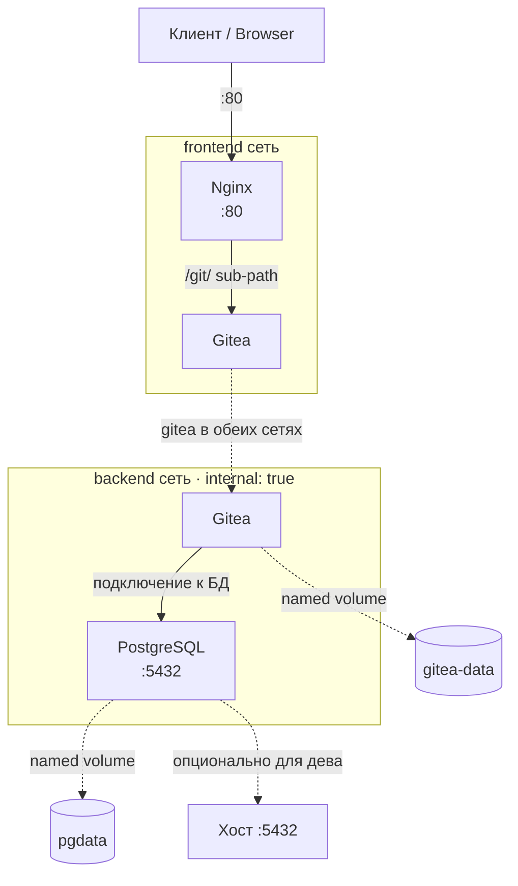

## О проекте

Production-like инфраструктура для self-hosted Git-сервиса в Docker Compose. 
Nginx работает как reverse proxy перед Gitea, которая хранит данные в базе 
PostgreSQL. Стек использует сегментацию сетей (изолированные frontend и backend 
сети), управление секретами через переменные окружения, persistent volumes для 
данных и healthcheck-зависимости при старте.

---
